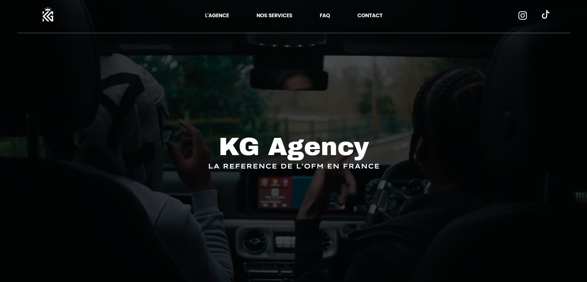

# 💼 KG Agency – Site Web

Bienvenue dans le dépôt du **site vitrine** de **KG Agency**, une agence spécialisée dans la gestion de carrières OFM (OnlyFans Management).  
L'agence accompagne leurs talents dans leur croissance digitale, leur image de marque et la gestion de leur contenu.

---

  

---

## 🔎 Objectif du site

- Présenter l’agence et ses services 📣  
- Mettre en avant les talents ⭐  
- Proposer un formulaire de contact 📬  
- Fournir les mentions légales et la politique de confidentialité 📄  

Le site est **responsive** et conçu pour une navigation fluide sur mobile, tablette et ordinateur.

---

## 🛠️ Technologies utilisées

- 💻 HTML5 / CSS3 / JavaScript
- 📦 Bootstrap 5 (CDN)
- 🎨 Google Fonts & RemixIcons
- 🎯 ScrollReveal pour les animations
- 📍 Hébergement : OVH 
- 🔐 RGPD conforme
  
